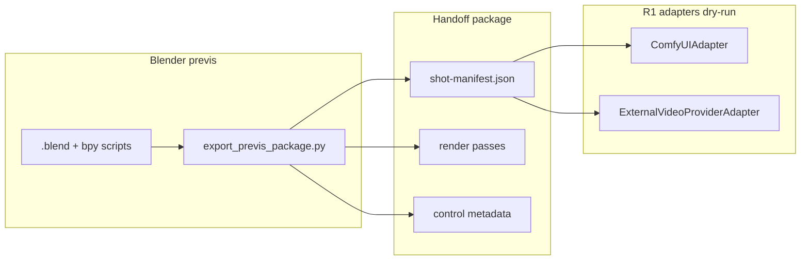

# Previs → AI Video Pipeline (R1)

R1 adds a **provider-neutral shot handoff** on top of the existing `video-production-director`, `video-blender-production`, and `video-production-qa` skills. It does not replace those skills or introduce a separate control plane.

## Architecture



| Layer | Path | Role |
|-------|------|------|
| Schema | `previs/schema/shot-manifest.schema.json` | Canonical manifest (fps, camera, passes, prompts, seed, provenance) |
| Packaging | `previs_pipeline/` | Validation, synthetic demo export, zip |
| Blender export | `previs/blender/export_previs_package.py` | Deterministic bpy export (live Blender gate) |
| ComfyUI | `previs/adapters/comfyui/` | Workflow template, staging, binding, expected output manifest |
| External API | `previs/adapters/external/` | Generic `provider_request.json` dry-run |

### Shot manifest (summary)

- **Identity:** `shot_id`, `manifest_version`
- **Timing:** `timeline.fps`, `frame_start`, `frame_end` (~12s demo: frames 1–288 @ 24fps)
- **Camera:** keyframed location/rotation, focal length, sensor width
- **Characters:** optional transforms + `action_refs`
- **Passes:** `beauty`, `depth`, `normals`, `object_mask`, `character_mask` (+ optional control passes)
- **Prompts / seed:** text metadata + deterministic `per_shot_derived` seed
- **Provenance:** SHA-256 of authoritative `.blend` / scripts / fixtures; `export_mode`; `blender_runtime` status

Optional hooks (`pose_projection`, `motion_vectors`) are recorded in `optional_hooks` and may be `skipped_unavailable` in R1.

## Commands

From repository root (Python 3.11+):

```powershell
python -m pip install -e ".[dev]"
python -m pytest previs/tests -q
python -m previs_pipeline.cli demo -o previs/out/demo_r1
python -m previs_pipeline.cli validate previs/out/demo_r1/demo_r1_12s
```

ComfyUI dry-run (no server):

```powershell
python -c "from pathlib import Path; from previs.adapters.comfyui import ComfyUIAdapter; a=ComfyUIAdapter(); print(a.run_dry_run(Path('previs/out/demo_r1/demo_r1_12s'), Path('previs/out/comfy_dry_run')))"
```

Live Blender export (workstation gate — **not run in CI worker**):

```text
blender your_scene.blend --background --python previs/blender/export_previs_package.py -- ^
  --output /path/to/out --shot-id shot_001
```

After export, run `python -m previs_pipeline.cli validate <package_dir>` and `video-production-qa` gates.

## ComfyUI conventions

See `previs/adapters/comfyui/CONVENTIONS.md` for workflow path, staging layout, binding table, and expected output manifest.

## Limitations (R1)

- No paid or live provider generation; adapters stop at request/staging/validation.
- Synthetic demo sets `provenance.blender_runtime: NOT_TESTED`.
- Blender bpy export script does not yet wire full compositor depth/normals/mask passes (beauty + camera JSON in R1); extend compositor before claiming full pass parity.
- Pose/skeleton and motion-vector exports are hooks only unless Blender runtime + rig data are available.

## Next gates

1. **Blender live:** Run `export_previs_package.py` on a disposable 10–15s scene; set `blender_runtime: PASS`; append `EXPERIMENT_LOG.md`.
2. **ComfyUI live:** Import `previs_handoff_v1.api.json`, run one-frame then full-shot generation; compare to `expected_output_manifest.json`.
3. **External provider:** Implement real HTTP client behind `ExternalVideoProviderAdapter` with credentials outside Git.

### Extension point for real execution

Implement `ProviderAdapter` subclasses:

- `build_request` — unchanged contract
- `stage_inputs` — same staging roots
- Replace `dry_run_validate` with `execute_and_collect_outputs()` that writes a **completed output manifest** (paths + SHA-256) and is called only after human gate / API key approval.

Entry hook: `ComfyUIAdapter.run_dry_run` → future `ComfyUIAdapter.run_live(comfy_url, ...)`.

## Skill integration

- **Director:** route Blender shots through manifest export before any AI video step.
- **Blender production:** checkpoint `.blend` + run export script; do not skip manifest validation.
- **QA:** verify manifest schema, pass hashes, frame/camera consistency, and adapter dry-run artifacts before declaring handoff ready.
