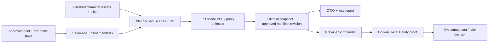

# Video preproduction architecture R1

상태: PM review용 설계. 기준일 2026-10-02. 실제 Blender 실행·렌더·모델 추론 검증은 수행하지 않았다.
대상: `zeroslove-ai/video-production-skills`, branch `research/previz-cinematography-r1`.

이번 보완은 **촬영/visual direction/reference/shot design 70%, Blender storyboard/previz/editorial architecture 20%, future backend handoff 10%**의 우선순위로 설계한다. 코드나 GPU 실행 비율이 아니다. [R2 backlog](R2_IMPLEMENTATION_BACKLOG.md)가 최신 구현 우선순위 정본이다. 최신 main을 fetch해 `29f943115c269d64d651bd641a4718b53236be00`을 확인한 뒤 지정 브랜치를 main에서 다시 구성했다. 기존 디자인 commit만 재적용했고 [Draft PR #4](https://github.com/zeroslove-ai/video-production-skills/pull/4)의 branch/code는 포함하지 않았다.

## 범위와 소유권

이 저장소는 완성된 character asset과 body/facial animation clip을 입력받아 shot, layout, camera, lighting, board, editorial을 구성한다. 모델링·리깅·retargeting·표정 생성·lip sync를 구현하지 않는다. 캐릭터/clip 호환성이 부족하면 upstream 요청과 GP placeholder를 남기며 캐릭터를 임의 교체하지 않는다. 외부 유료 video API의 호출·결제·통합, 모델 다운로드, 장시간 렌더는 R1 범위 밖이다.

읽은 기존 자료: README, INSTALL, UPSTREAM, 세 `skills/*/SKILL.md`, workstation brief, MCP setup, EXPERIMENT_LOG. base revision `29f9431`. `.agents/skills` 배포 snapshot도 존재한다. README는 이 repo를 stack 정본으로 설명하지만 INSTALL은 skill 정본을 `zeroslove-ai/agent-skills`로 지정한다. **설계/데이터 계약은 이 repo에 두고, R2 skill 변경은 중앙 정본에서 먼저 수정 후 양쪽 snapshot으로 전파**하는 정책을 제안한다. 기존 source는 R1에서 수정하지 않는다. workstation gate A–F 완료 증거가 없으므로 production-ready token을 발행하지 않는다.

## 기존 skill과 새 skill의 경계

| 위치 | R2에 추가할 내용 | 이미 있는 책임 / 중복하지 않을 내용 |
|---|---|---|
| video-production-director | production mode 선택, approved reference pack/manifest 고정, preproduction gate 라우팅 | research → brief → fresh build, tool 선택, 최종 QA |
| video-blender-production | manifest 실행 entry point, shot scene/VSE inspect, export contract 검사 | MCP live correction, durable bpy, checkpoint, single writer |
| video-production-qa | manifest/asset hash, cut continuity, pass alignment, OTIO loss report, character fidelity 검사 | source→state→motion→image→audio→delivery gate |
| 별도 video-storyboard-previz (제안) | beat → shot 후보 → GP board → 3D layout → animatic → locked manifest | render engine 운영이나 character animation 제작 없음 |
| 별도 video-cinematography (제안) | 감정별 촬영 recipe, reference provenance/approved pack, camera/look calibration과 예외 기록 | generic image generation/provider 통합 없음 |
| 별도 video-editorial (제안) | VSE snapshot ↔ manifest ↔ OTIO, conform/loss report | 최종 인코딩은 기존 FFmpeg/Remotion 경로 재사용 |
| optional adapter, 아직 skill 아님 | Comfy proof bundle 변환·기록 | production routing의 필수 의존성으로 두지 않음 |

새 skill의 수를 최소화하려면 초기 R2에서 editorial을 video-storyboard-previz의 reference 문서로 두고 실제 import/export 반복이 확인된 뒤 분리한다. 위 이름들은 제안이며 R1에는 runnable skill을 설치하지 않는다.

판단 기준: storyboard-previz는 반복되는 독립 beat→board→animatic 단계이고 다른 캐릭터 프로젝트에도 재사용된다. cinematography는 독립적인 reference/shot/look 조정 요청에 재사용되며 director에 모든 recipe를 넣으면 비대해지므로 별도 skill 후보가 적절하다. video-editorial은 재사용성은 높지만 초기 작업량이 VSE assembly 수준이면 기존 preproduction reference로 충분하다. separate visual-reference skill은 당장은 늘리지 않고 cinematography의 module로 둔다.

## 공식 기능과 설계 판단

Blender 5.0의 Storyboarding은 shot Scene, GP, VSE, linked resource를 함께 사용하는 native workflow다. 별도 storyboarding add-on을 필수로 하지 않는다. [Blender 5.0 Storyboarding](https://docs.blender.org/manual/en/5.0/video_editing/storyboarding/index.html).

공식 app template은 2D Animation에서 출발하며 Edit scene, shot scene asset, example shots와 Sync Scene을 제공한다. 이것은 UI 출발점이고 본 repo manifest를 읽는 자동 builder는 **R2 custom implementation**이다. [App template](https://docs.blender.org/manual/nl/5.0/video_editing/storyboarding/app_template.html).

5.0 release는 scene assets/VSE story tools와 Python API 변경을 명시한다. 4.x script를 그대로 재사용하지 않는다. [5.0 release](https://www.blender.org/download/releases/5-0/). native storyboard 최소 조사 기준은 5.0, 실제 stack live MCP 실행 기준은 기존 SETUP의 5.1+이며 서로 다른 조건이다. R2는 설치된 exact patch/build와 API capability를 pin하고 5.x 전체를 호환 검증했다고 주장하지 않는다.

## 데이터 흐름과 authoritative state

장기 순서: Idea/Script → Story Beat → Visual Reference → Shot Design/Cinematography → Storyboard → Blender Previz → Animatic → Editorial Approval → Final Blender Production **또는** PR #4 style generative handoff → Final Edit. handoff는 승인된 shot/editorial 뒤에 위치한다. PR #4는 RGB/depth/first-last/manifest/FFmpeg backend evidence로 보존하며 새 adapter/provider 연구로 확장하지 않는다.

Manifest가 shot 의도·ID·시간·asset revision의 정본이다. Blender는 실행 결과와 아티스트 수정의 작업 상태다. 수동 VSE edit은 자동으로 manifest를 덮어쓰지 않는다. `inspect → proposed editorial diff → approved new revision → rebuild`로 되돌린다. input manifest hash와 current VSE snapshot hash가 다르면 stale export를 중단한다. ID는 순서가 바뀌어도 고정하고 take/revision을 올린다.

제안 project layout (R2 생성물): `projects/<sequence_id>/inputs/`, `manifests/`, `references/`, `source/build.py`, `blend/`, `exports/<shot_id>/<revision>/`, `editorial/`, `evidence/`. library/clip은 immutable URI + SHA256으로 식별한다. R1의 `examples/previz/`는 합성 placeholder 경로만 가진 설계 fixture이며 실제 asset 증거가 아니다.

## 자동 storyboard / 3D previz 단계

1. Director가 mode, logline, beat별 목적, fps/aspect, asset authority, 수동 검토 항목을 고정한다. 대사 길이보다 짧은 컷은 수정한다.
2. Reference pack에서 허용 lens/composition/mood와 금지 사례를 선택한다. Agent가 beat당 2–3 camera 후보를 제안하고 preset ID와 선택 이유를 기록한다.
3. Asset intake: object/root 이름, meter scale, forward/up, immutable clip range/fps, root motion policy, eye/head/hand landmark 제공 여부를 검사한다. rig/clip bind는 upstream이 제공한 compatible binding만 소비한다. 없는 anchor는 수동 locator 또는 GP marker로 표기한다.
4. Shot별 Scene 생성. set/character library는 link, placement/camera/light/GP는 shot-local collection. scene duplication이 shared action/camera를 함께 바꾸지 않도록 data-block ownership read-back 검사. library override는 placement/binding에 필요한 승인 범위만 사용한다.
5. GP layer를 `layout`, `action_arrows`, `camera_notes`, `dialogue`, `review`로 분리한다. start/beat/end key panel에 기존 clip의 샘플 pose를 배치하거나 손으로 보완한다. GP는 animation을 대신 만드는 데이터가 아니다.
6. Camera 후보는 bounding box/landmark projection으로 fit한다. sensor/FOV/aspect를 먼저 고정하고 subject 위치/크기로 거리 계산, near clipping·occlusion·화면 방향 확인. preset의 lens mm만으로 framing을 결정하지 않는다.
7. Edit Scene에 shot SceneStrip과 sound/text를 배치한다. source shot에는 Edit Scene을 넣지 않아 recursive evaluation을 막는다. shot local timeline과 edit timeline을 명시적으로 변환한다.
8. Cheap panel/contact sheet로 composition review 후 low-resolution proxy animatic. 수정된 shot만 캐시 무효화한다. UI Sync Scene 편의 기능과 batch bpy 실행을 분리한다.
9. state QA와 start/mid/end/cut-boundary evidence, 대사 timing 검토 후 locked manifest revision과 export index를 저장한다.

R2 builder는 이름 대신 stable ID custom property로 소유 객체를 추적하고 같은 manifest 재실행 시 duplicate를 만들지 않는다. 입력 asset을 수정하지 않고 project-owned scene만 업데이트하며 이전 approved checkpoint를 보존한다. 실패 시 incomplete bundle을 final로 rename하지 않는다.

Storyboard는 수작업 그림 없이도 가능하도록 finished clip sample+character/environment proxy+camera frame을 기본 board로 사용하고 GP는 자동 annotation이다. Stage A script는 narrative information과 emotional response beat로 분리; Stage B board는 camera 후보 panel; Stage C previz는 composition→blocking→position→motion→timing→eyeline→transition→rough light; Stage D animatic는 audio/reaction/cut rhythm을 평가한다.

Blender를 virtual camera rehearsal tool로 사용한다. 동일 shot scene의 camera candidates는 marker binding으로 전환해 비교할 수 있지만 locked delivery는 shot manifest에 선택 camera ID를 고정한다. timeline camera markers는 native switching 기능이며 UI keybinding은 editor context에 따라 다르다. [Markers](https://docs.blender.org/manual/en/latest/animation/markers.html).

Workbench/Eevee viewport preview는 cheap rehearsal에 적합하나 현재 active view를 렌더하므로 camera view/overlay state를 확인한다. headless execution은 UI viewport operator와 별도 경로로 Eevee/Workbench camera render를 사용한다. [Viewport render](https://docs.blender.org/manual/en/latest/editors/3dview/viewport_render.html) (열람 latest=5.2 LTS; installed patch로 재검증). question gate: composition 좋은가 / lens가 emotion에 맞는가 / acting readable인가 / cut timing과 sequence flow가 맞는가 / face/eye appeal이 유지되는가. final material quality는 이 단계 목표가 아니다.

## Manifest 시간 규약

JSON Schema draft 2020-12. `fps={numerator,denominator}`는 기약 양의 유리수. 모든 range는 `start + duration`의 반개구간 `[start,start+duration)`. Sequence edit origin은 0, shot Blender source origin은 1. duration은 integer frame, seconds는 계산값만 사용한다.

예: shot source `[1,49)`의 48 frames를 edit `[0,48)`에 놓는다. Blender render `frame_start=1`, inclusive `frame_end=48`; VSE displayed `frame_final_end`는 배타적 end. source sample = `source.start + edit_frame - timeline_start`. handles는 cut 전/후의 추가 source frames이며 editorial duration에 포함하지 않는다. R1 fixtures는 handles 0; R2에서 8-frame handles를 쓰려면 upstream clip availability와 shot render source를 확장한다.

Schemas는 타입/필수 필드/enum을 검사한다. 서로 다른 문서의 ID, fps/aspect 일치, URI/asset hash 실제 존재, duration 합계, source availability, track overlap/gap, preset compatibility, reference 승인 상태는 semantic validator/QA 책임이다. schema 통과를 생산 readiness로 오해하지 않는다. R1 sequence model은 single V1 straight cuts + 명시적 gap과 독립 audio tracks다. dissolve/retime/nesting은 R2 expansion 또는 bake/loss report 대상으로 명시한다.

## OTIO editorial interchange 조사 및 결정

OTIO는 media 자체를 렌더하지 않고 편집 구조와 참조를 교환한다. native `.otio`와 bundle adapter, 추가 format plugin을 구분한다. 공식 adapter 목록을 근거로 Blender native adapter가 있다고 가정하지 않으며 R2에서 manifest/VSE bridge를 작성한다. [Adapters](https://opentimelineio.readthedocs.io/en/latest/tutorials/adapters.html).

| 우리 데이터 | OTIO mapping | R1 제한 |
|---|---|---|
| sequence ID + fps | Timeline metadata + RationalTime rate `num/den` | numerator/denominator도 metadata로 보존 |
| shot entry | Clip name=shot_id, ExternalReference=proxy URI | `.blend` scene을 media로 취급하지 않음 |
| shot render range | media_reference.available_range | handles 포함, proxy의 zero-based media offset으로 변환 |
| shot source selection | Clip.source_range | source scene frame와 media frame의 offset을 metadata에 저장 |
| timeline gap | Gap | 암묵적 gap 자동 보정 금지 |
| audio track | Audio Track + Clip + ExternalReference | J/L-cut은 별도 audio placement, source fps는 project fps로 표현 |
| GP/camera/light/asset/ref | namespaced `video_preproduction` metadata | 타 editor가 보존하지 않을 수 있어 sidecar manifest 유지 |
| VSE effect/subtitle/retime | loss report + rendered bake reference | silently flattened 성공 처리 금지 |

OTIO source range와 parent timeline range는 다른 좌표계다. [Time ranges](https://opentimelineio.readthedocs.io/en/latest/tutorials/time-ranges.html). Export는 proxy frame 0이 Blender `source.start - handles_in`에 대응하도록 기록한다. cut source_range.start=handles_in, duration=shot cut duration. 아직 proxy가 없으면 MissingReference와 missing-media report를 사용하며 유효 media 교환이라고 주장하지 않는다.

R2 acceptance: 3 fixtures의 manifest → OTIO → manifest에서 shot ID/order/source in/out, gap, fps, audio start/duration, metadata 보존. 24000/1001 timing도 정수 frame 비교하고 wall-clock 오차를 측정. target editor 한 종류로 실제 relink/import 결과 별도 검증. plugin AAF/XML/EDL은 설치/version pin과 format별 loss matrix 없이는 full fidelity 약속하지 않는다.

## Gate / 자동화와 artistic judgment

| 항목 | 자동화 | 사람 판단을 agent rule/reference로 전달하는 방법 |
|---|---|---|
| asset identity, frame/rate, render alignment | hash/range/schema/state 검증 | 실패 시 upstream 요청, 임의 대체 금지 |
| camera fit, axis, shot size, caption clearance | landmark projection + screen-space metrics | 승인 golden frame, 수치 허용범위 + 예외 사유 |
| emotion/subtext, performance 선택 | beat별 후보/clip catalog matching | beat intention, positive/negative panel 쌍, actor clip 선택 승인 |
| flattering 얼굴 각도/눈 가독성 | yaw/pitch·eye visibility 경고 | 캐릭터별 approved angle/eye atlas; 수치 하나로 미적 합격 판정 금지 |
| lighting/mood/style | locked preset + histogram/palette comparison | look key 승인, identity drift reject 사례 |
| cut rhythm/dialogue silence | audio duration/beat marker 대조 | 승인 animatic와 pause range, surprise beat 예외 |
| final artistic acceptance | evidence pack 생성·차이 보고 | named reviewer + revision + decision log |

Agent는 explicit approved reference와 exception policy 내에서 변형할 수 있다. 기준 자료가 없으면 neutral preset + draft status를 유지한다. 사람 판단을 완전히 제거한다고 주장하지 않는다. PM은 범위/우선순위, art reviewer는 look/연기/리듬 승인 담당이다.

## Recommended R2 implementation backlog

최신 [R2 backlog](R2_IMPLEMENTATION_BACKLOG.md)를 따른다. 우선순위는 finished asset intake → approved visual atlas/reference calibration → framing 후보 평가 → runtime readiness → SEQ_A camera rehearsal/animatic → SEQ_B continuity/editorial → SEQ_C gameplay return이다. 기존 backend/export 재사용은 마지막 호환성 audit에 둔다. exporter/Comfy/API 구현을 이번 R1에서 늘리지 않는다.

PM 검토 요청: skill 정본 정책 수용 여부, mode별 fixture의 스토리/길이, incoming asset owner와 format, golden reference reviewer, P0 순서 승인. R1은 source/docs/JSON 검증만 완료한 design checkpoint이며 새 제작을 시작하지 않는다.
