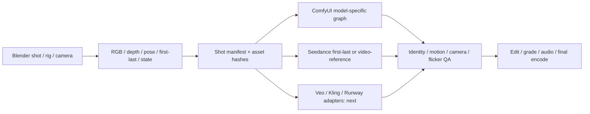

# Blender 프리비즈 → 생성 영상 연구

확인일: **2026-10-02 KST**. 정본: `zeroslove-ai/video-production-skills`.
기준 main: `29f9431`; 작업 브랜치: `research/blender-previz-provider-poc-20261002`.
원격 main을 새로 clone했다. 기존 `research/local-video-gen-r0`의 H3 실험은
읽기만 했고 합치거나 수정하지 않았다. 별도 checkout에서만 작업한다.

## 결론과 구현 범위

**가능하다.** Blender를 구도·시간·동작의 원본으로 두고, 모델별로 받는 입력을
내보내면 ComfyUI와 외부 provider 모두 연결할 수 있다. 다만 ComfyUI는 실행기이며
모든 영상 모델이 depth/pose/영상/끝 프레임을 동시에 받는 것은 아니다.
시작·끝 프레임만 보내는 경로는 중간 동작을 구속하지 않는다. 렌더를 RGB video
reference로 보내는 경로도 원본 카메라와 geometry의 정확한 재현을 보장하지 않는다.
이는 입력 구조에 따른 설계 판단이며 이번 작업의 생성 품질 벤치마크 결과는 아니다.

이번 PoC: 새 Blender 장면 → RGB와 고정 범위 depth PNG sequence → MP4/first/last/
camera state/hash → ComfyUI Fun Control API graph 및 Seedance 1.5/2.0/2.5 요청 준비.
Blender/FFmpeg는 실제 실행 검증했다. GPU 확산 생성·외부 유료 생성·인간 pose·
캐릭터 일관성은 검증하지 않았다. `evidence/previz/VALIDATION.md`가 실행 증거다.

## ComfyUI conditioning 비교

| 목적 | 가능한 경로 | Blender 입력 | 제약 / 남은 검증 |
|---|---|---|---|
| Image-to-video | Wan I2V 등 해당 checkpoint | 승인된 RGB 첫 프레임 | geometry와 카메라 경로의 중간 구속 없음 |
| Depth/pose/edge/trajectory | Wan2.2 Fun Control | depth 또는 OpenPose 방식 control video + reference image | 전용 high/low noise weights 필요; 범용 I2V에 control 영상을 임의 연결할 수 없음 |
| First + last | Wan2.2 Fun Inp / FLF2V 계열 | 같은 shot 양 끝 RGB | 모델에 맞는 노드·weights 조합; 끝점 사이의 경로는 별도 평가 |
| Video/mask/reference | Wan2.1 VACE | RGB/control video, mask, reference image | VACE용 모델과 latent trim 경로 필요; 원본 video 보존 강도와 편집 범위 조절 |
| 캐릭터 동작 전이 | Wan2.2 Animate | 캐릭터 reference + driving pose/face video | human rig→모델 joint 표현 변환; DWPose/KJNodes 호환성; 얼굴·손·가림·다인물 취약성 평가 |
| Camera control | Wan2.2 Fun Camera | 시간별 camera pose/intrinsics | Blender 좌표계·camera -Z 방향·단위·시간축을 모델 convention으로 변환해야 함 |

공식 근거: [Fun Control](https://docs.comfy.org/tutorials/video/wan/wan2-2-fun-control),
[Fun Inp](https://docs.comfy.org/tutorials/video/wan/wan2-2-fun-inp),
[VACE](https://docs.comfy.org/tutorials/video/wan/vace),
[Animate](https://docs.comfy.org/tutorials/video/wan/wan2-2-animate),
[Fun Camera](https://docs.comfy.org/tutorials/video/wan/wan2-2-fun-camera).

이번 Control graph는 depth video를 이미 준비된 conditioning으로 받는다.
예제의 pose를 depth로 바꿀 때 Canny/DWPose preprocessing을 다시 적용하지 않는다.
depth와 pose를 동시에 독립 채널로 결합하는 adapter는 구현하지 않았다.
확인한 schema에서는 첫 이미지가 `ref_image`에 연결되며 first-frame anchor가 아니다.
Python execute 함수에 start_image 인자가 있어도 public schema에 없으면 보내지 않는다.
노드의 `ref_image` 지원과 실제 모델의 identity retention은 별개의 검증 항목이다.

고정 seed는 재현에 도움을 주지만 캐릭터 고정 장치가 아니다. 먼저 reference sheet와
shot의 첫 프레임을 승인하고, 같은 reference/의상/색/LoRA 버전을 shot별로 유지한다.
Animate 또는 모델 호환 character LoRA를 별도로 검증하고, 시선·손·회전·가림·역광·
장면 전환을 테스트한다. 필요하면 Blender에서 얼굴/제품/로고를 렌더해 최종 합성한다.
실루엣·pose 추종과 identity 보존은 다른 점수로 기록해야 한다.

## 외부 provider 비교

| Provider / 확인한 endpoint | 입력/기능 | 적합한 프리비즈 경로 | 이번 구현 |
|---|---|---|---|
| fal Seedance 1.5 Pro `fal-ai/bytedance/seedance/v1.5/pro/image-to-video` | `image_url`, `end_image_url`, prompt, duration, seed, audio | 첫/끝 프레임 기반 스타일 결과; 중간 동작 보존 요구가 약한 shot | dry-run + REST queue submit/status |
| fal Seedance 2.0 `bytedance/seedance-2.0/reference-to-video` | image/video/audio reference; prompt의 `@Image1`/`@Video1` | Blender RGB video를 motion/camera reference로 지정 | hosted URL payload + REST queue |
| fal Seedance 2.5 `bytedance/seedance-2.5/reference-to-video` | reference/editing/extension task; multimodal reference | 더 긴 shot 또는 video editing 후보 | reference task만 구현; 품질 미검증 |
| BytePlus ModelArk Seedance | first/last와 omni reference 모드; account/model activation 필요 | 직접 provider 계약·storage를 운영할 때 | 조사만; fal URL/payload와 혼용 금지 |
| Veo 3.1 Gemini API | first/last frame, reference images, extension | 승인 이미지와 shot 연결·audio 생성 후보 | 조사만; operation polling adapter 별도 필요 |
| Kling 3 Pro via fal | start/end 이미지, character/object elements, multi-shot, audio | 캐릭터 reference와 shot 제작 비교 후보 | 조사만; depth/pose 전용 API로 해석하지 않음 |
| Runway Aleph 2.0 | video + text/image → video | RGB 프리비즈 편집/스타일 변환 후보 | 조사만; 정확한 motion retention은 A/B 필요 |

근거: [Seedance 1.5 API](https://fal.ai/models/fal-ai/bytedance/seedance/v1.5/pro/image-to-video/api),
[Seedance 2.0 API](https://fal.ai/models/bytedance/seedance-2.0/reference-to-video/api),
[Seedance 2.5 API](https://fal.ai/models/bytedance/seedance-2.5/reference-to-video/api),
[BytePlus task API](https://docs.byteplus.com/en/docs/modelark/create-video-generation-task-api),
[Veo](https://ai.google.dev/gemini-api/docs/veo?hl=en),
[Kling](https://fal.ai/models/fal-ai/kling-video/v3/pro/image-to-video/api),
[Runway model table](https://docs.dev.runwayml.com/guides/models/).
목록은 확인한 후보이며 시장 전체를 망라하거나 최신 모델 성능 순위를 뜻하지 않는다.

Seedance 2.0 reference video는 길이/크기/해상도 제한이 있다. 문서상 최대 3개,
합계 2–15초, 50 MB 미만이며 입력 해상도 범위가 제한된다. 2.5는 다른 제한을 사용하고
24–60 fps를 요구한다. PoC의 `reference-video.mp4`는 640×640 letterbox, 24 fps로
만들어 두 경로의 입력 후보로 준비한다. 실제 업로드 URL과 provider의 서버 검증은
미확인이다. `beauty.mp4`/`depth.mp4`를 그대로 모든 provider에 보내지 않는다.

Seedance 2.x reference의 끝 이미지 지정은 reference 순서만으로 FLF 제약이 되지 않는다.
1.5 endpoint와 2.x reference endpoint는 별도 요청이다. 2.5 editing/extension의 자동
duration/aspect 처리도 reference adapter에 그대로 적용하지 않는다.

가격·계정 사용 가능 모델·지역·대기시간은 실행 직전에 확인한다. 이번에는 가격을
고정하거나 유료 호출을 하지 않았다. 현 환경에는 `FAL_KEY`가 설정되지 않았다.
비교 비용은 한 번의 생성 가격보다 **승인된 shot당 총비용 = 모든 실패 take 포함 생성비
+ 작업 시간 + 로컬 GPU 시간 + storage/egress**로 계산한다.

## 자동화와 품질 gate

공통 shot manifest에 prompt/seed/dimensions/fps/frame count/provider duration/reference를
고정한다. sequence는 0001부터 연속이고 RGB/depth는 같은 camera·프레임을 사용한다.
depth는 shot 전체 동일 near/far로 매핑한다. frame마다 정규화하면 거리가 흔들린다.
현재 exporter는 camera-space Z shader의 display-encoded grayscale PNG이며 metric EXR
Z-pass가 아니다. 모델이 학습한 depth 분포·근거리 밝기 방향·감마는 실제 생성으로
보정해야 한다. pose는 rig joint order·투영·occlusion·색을 고정하고 별도 golden frame을 둔다.

81 frames / 16 fps = 5.0625초이고 첫→끝 keyframe 간격은 5초다. provider 요청은
5초다. frame count를 억지로 동일하게 간주하지 말고, 출력 ffprobe와 event time을 확인하고
최종 편집 단계에서 trim/retime을 결정한다. 샘플 구도는 5:3이고 provider aspect는 auto;
납품 16:9를 고정하려면 Blender width/height를 768×432로 함께 변경하고 재렌더한다.

ComfyUI: `/object_info` → 파일 업로드 → `/prompt` → prompt_id checkpoint →
`/history/{id}` → 결과 검사. [서버 API](https://docs.comfy.org/development/comfyui-server/comms_routes).
API graph와 UI canvas JSON을 구별한다. queue accepted는 렌더 성공이 아니다.
fal: [queue protocol](https://fal.ai/docs/documentation/model-apis/inference/queue)에 따라
request_id/status_url/response_url을 저장하고 status/result를 따로 조회한다.
서버가 요청을 받았는지 불명확한 timeout에는 자동 재전송하지 않는다.

다음 평가를 동일 shot의 3 seeds로 실행한다. 각 결과에 모델 revision, workflow hash,
input/output hash, GPU/RAM, 시간/비용, output fps/길이, 첫/중간/끝 contact sheet를 남긴다.

| Gate | 판정 방법 / 제안한 초기 기준 |
|---|---|
| 구조 | subject/object 수와 주요 실루엣; object 복제 0, 불필요한 cut 0 |
| 동작 | 시간 정렬 후 표적 center trajectory 오차; 화면 대각선의 5% 이하 목표 |
| 카메라 | background landmarks·가림 순서; 원본 dolly 방향 반전 0 |
| 캐릭터 | reference 대비 얼굴/의상/색/인원; 전 shot 눈검사, 동일성 오류 0 |
| 시간 안정성 | warped geometry/손/얼굴, flicker, 경계 cut을 play-through로 검사 |
| 납품 | duration ±1 frame, 지정 resolution/fps/audio stream 확인 |

위 수치는 제안한 승인 기준이며 이번에는 생성 출력 점수나 자동 평가기를 만들지 않았다.
프리비즈 그대로의 카메라/geometry가 hard constraint라면 최종 Blender 렌더+합성을
우선한다. 생성 모델에는 재질/배경/분위기 등 변형이 허용되는 범위를 맡긴다.

## 실행 환경과 다음 bounded 실험

Blender 5.2.1 LTS `9e2066aef7ef`, system Python 3.13.3, RTX 4080 SUPER 16 GB.
기존 ComfyUI revision `8fed37813848259fbdd2548ae3cd9f14df7fd68b`은 읽기만 했다.
8188은 닫혀 있고 Fun Control high/low weights와 Wan2.1 VAE는 없었다.
UMT5 encoder는 있었지만 이것만으로 실행 가능하지 않다. 공식 문서의 24 GB GPU
사례를 이 16 GB 장비의 성능 보장으로 옮기지 않는다. 신규 model download/업그레이드 없음.

1. 독립 ComfyUI 환경에서 graph/model 호환성과 VRAM offload를 확인하고 depth 한 shot 생성.
2. 승인한 캐릭터 reference와 humanoid rig를 붙여 OpenPose/Animate 한 shot 비교.
3. `reference-video.mp4`와 승인 이미지의 실제 hosted URL로 Seedance 2.0/2.5 각각 한 take.
4. motion/identity가 무너지면 Aleph video edit 또는 Blender 최종 렌더 경로 비교.
5. 승인 기준을 통과한 adapter만 canonical production skill에 반영. 현재 기존 스킬의
   readiness나 R1 workstation gate를 통과 처리하지 않는다.

실행 절차는 [RUNBOOK.md](RUNBOOK.md), graph 변형 안내는
[workflow README](../../workflows/previz/README.md)를 따른다.
